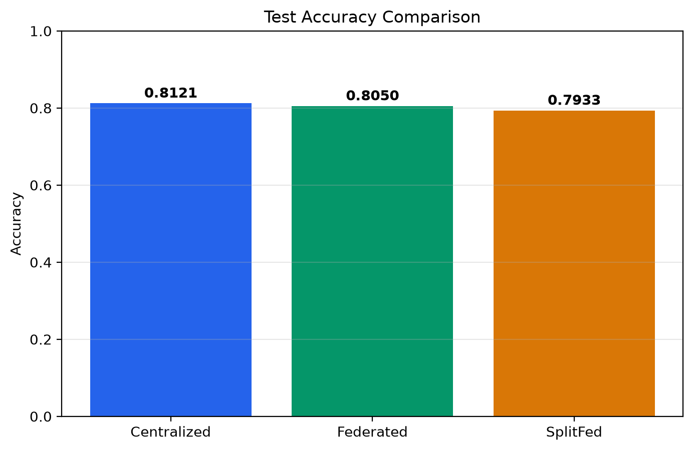
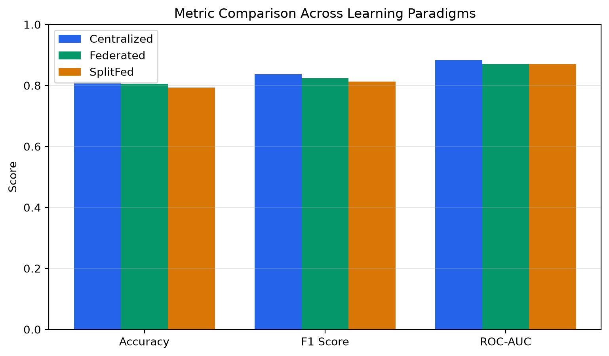
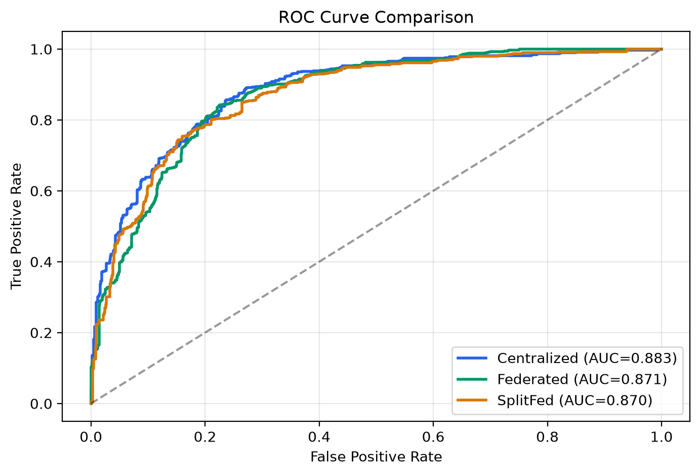
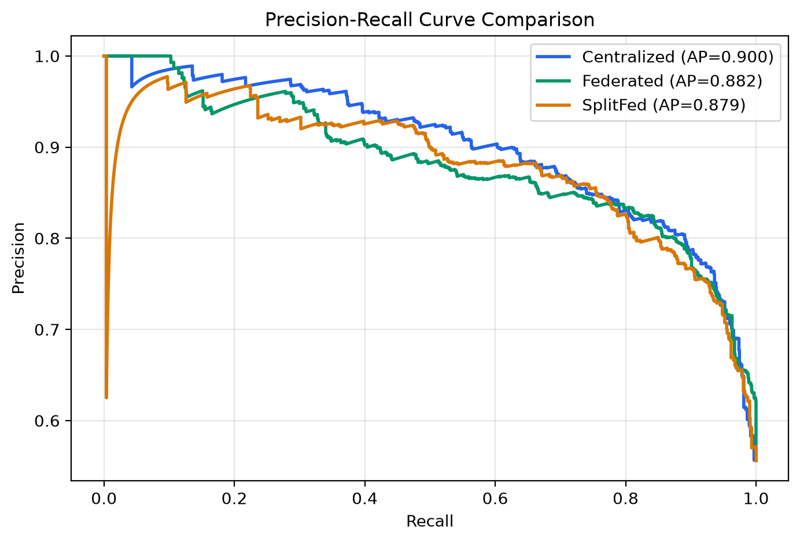
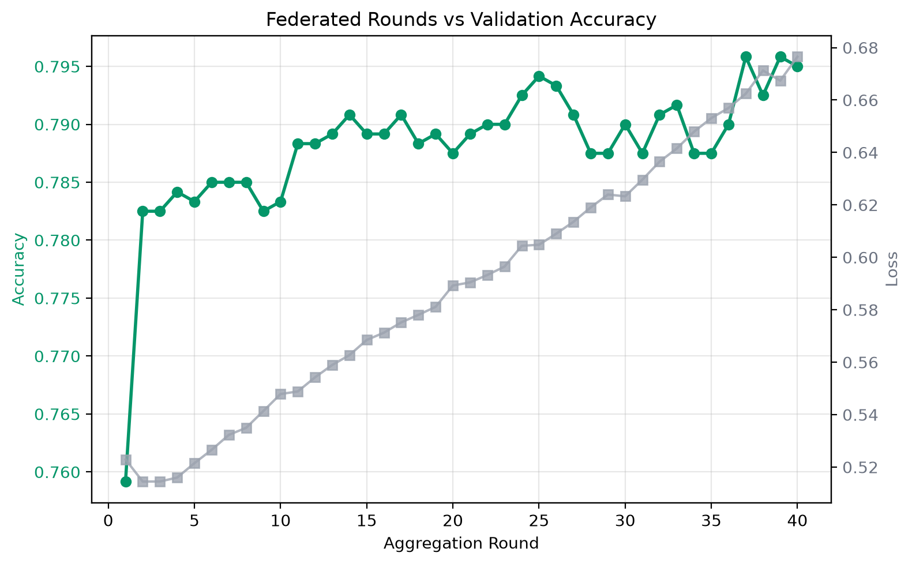
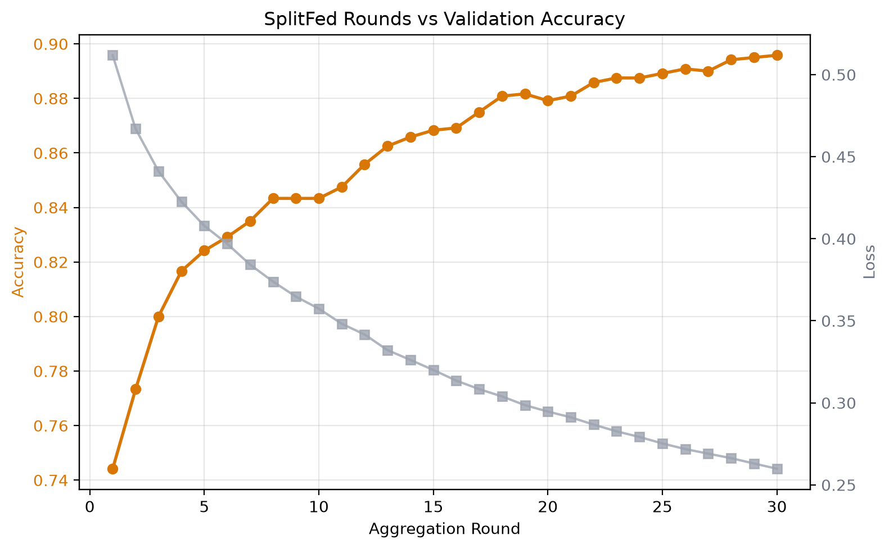
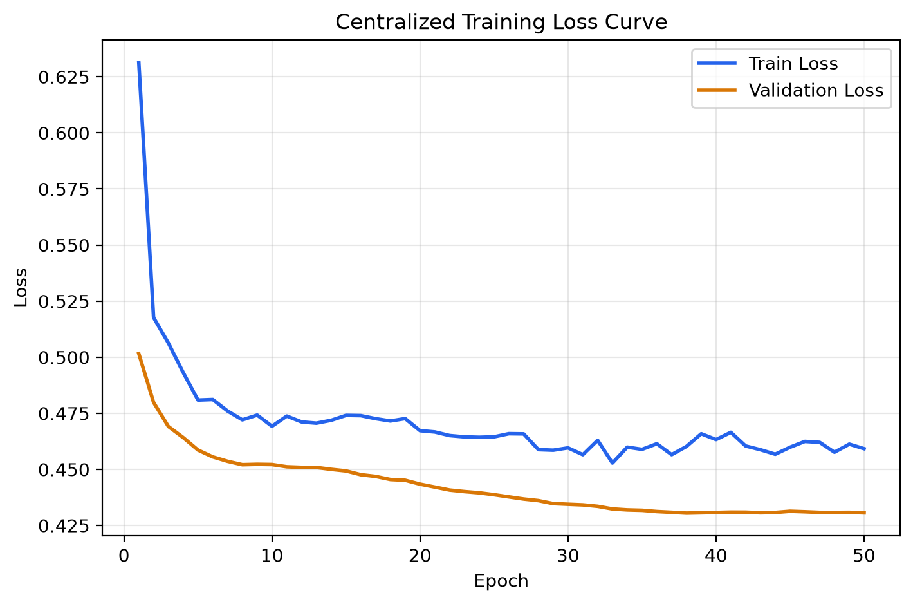
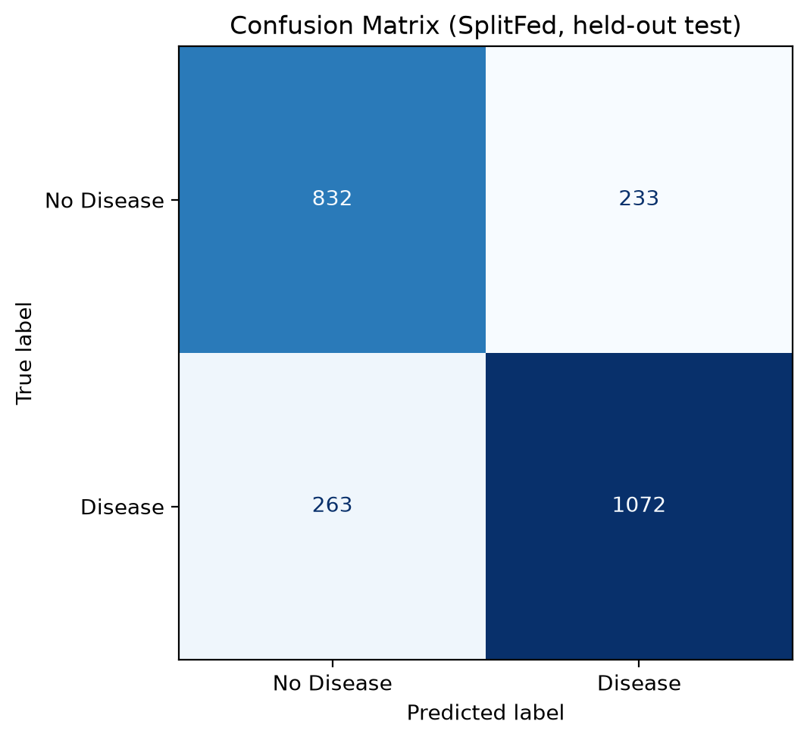

# Privacy-Preserving Healthcare Learning with Federated and SplitFed Pipelines

## Project Overview

This repository implements a research-oriented healthcare machine learning system for binary heart-disease prediction under strict privacy constraints. It compares three training paradigms on the same dataset family and evaluation protocol:

- Centralized learning
- Federated Learning (Flower + FedProx)
- SplitFed (split learning + federated aggregation)

The codebase is organized for reproducibility, modularity, and benchmark-style experimentation.

## Problem Statement

Healthcare institutions often cannot pool patient records due to privacy, compliance, and ownership constraints. Standard centralized ML workflows are therefore difficult to deploy in real-world medical settings.

The challenge is to train accurate models while keeping raw hospital data local.

## Solution Summary

The project uses distributed learning strategies that avoid raw-data exchange:

- Federated training performs local updates on each hospital partition and aggregates model parameters centrally.
- SplitFed further partitions the model into client-side and server-side segments so clients send activations rather than full feature records.
- A shared privacy-safe data pipeline enforces client-local scaling and strict held-out test evaluation.

## Architecture (Text Description)

1. Raw tabular data is loaded, validated, encoded, and expanded into a reproducible training corpus.
2. Non-IID hospital partitions are generated for five clients.
3. For each hospital, train/validation/test splits are created independently and scaled using train-only statistics.
4. Centralized pipeline trains a full model on the combined train split and evaluates on a strictly unseen global test split.
5. Federated pipeline runs FedProx rounds over hospital clients and evaluates the final global model on the same global test split.
6. SplitFed pipeline trains split client/server components per round, aggregates client-side weights, and evaluates on the same global test split.
7. Metrics and research artifacts are saved to `data/processed` and `plots`.

## Tech Stack

### Backend

- Python 3.10+
- TensorFlow / Keras
- Flower (FL simulation)
- NumPy, Pandas, scikit-learn, Matplotlib
- FastAPI (metrics API)

### Frontend Dashboard

- React (Vite)
- Tailwind CSS
- Recharts
- Framer Motion

## How to Run

### 1. Backend Setup

```bash
python3 -m venv venv
source venv/bin/activate
pip install -r requirements.txt
```

### 2. Run Training Pipelines

```bash
python src/pipelines/train_eval_pipeline.py
python src/pipelines/federated_pipeline.py
python src/pipelines/splitfed_pipeline.py
```

### 3. Start Metrics API (Optional)

```bash
uvicorn src.utils.api_server:app --reload
```

### 4. Run Frontend Dashboard

```bash
cd frontend
npm install
npm run dev
```

## Results (Current Run)

| Method | Accuracy | Precision | Recall | F1 Score | ROC-AUC | Loss |
| --- | ---: | ---: | ---: | ---: | ---: | ---: |
| Centralized | 81.21% | 80.91% | 86.67% | 83.69% | 0.8831 | 0.4255 |
| Federated (FedProx) | 80.50% | 82.47% | 82.47% | 82.47% | 0.8711 | 0.6443 |
| SplitFed | 79.33% | 82.15% | 80.30% | 81.21% | 0.8696 | 0.5008 |

Metrics source: `data/processed/final_metrics.json`. Results are deterministic
(fixed seeds + TensorFlow op-determinism) and reproduce exactly on re-run.

The ordering follows the expected hierarchy: **Centralized ≥ Federated ≥ SplitFed**.
Centralized sees all data jointly and forms the upper bound; Federated pays a small cost
for keeping data local under non-IID partitions; SplitFed pays a further cost for
splitting the model across the client/server boundary. All three stay within a narrow,
realistic band on genuinely held-out patients.

## Methodology & Refinements

The three training paradigms are unchanged. The pipeline was hardened for correctness and
fairness:

- **Leakage-free evaluation.** The original patient records are partitioned into disjoint
  train and test sets **before** any bootstrap augmentation, so a held-out patient's
  augmented near-duplicates can never appear in training. A collision check confirms 0%
  overlap between train and test rows. (Earlier runs augmented first and split second,
  which let near-duplicates straddle the boundary and inflated every score.)
- **LayerNormalization in place of BatchNormalization** across the full, client, and
  server models. Batch statistics are ill-defined when weights are averaged across
  non-IID hospitals; LayerNorm is per-sample and aggregation-safe.
- **Standard 0.5 decision threshold** applied identically to all three methods for a
  directly comparable operating point on the near-balanced classes.
- **Training schedule**: `ReduceLROnPlateau` with early stopping for the centralized
  model; FedProx over 40 rounds; SplitFed over 30 aggregation rounds.
- **Reproducibility**: fixed seeds and TensorFlow op-determinism across all pipelines.

## Key Insights

- Centralized learning is the upper bound (81.21%); the distributed methods trail it by a
  small, expected margin rather than exceeding it.
- Removing the train/test augmentation leakage brought SplitFed from an inflated ~88% down
  to a realistic 79.33%, restoring the correct method hierarchy.
- Federated training is competitive with centralized (80.50%) and well-calibrated under
  non-IID partitions after the normalization fix.
- Client-local scaling, a disjoint held-out test set, and a shared 0.5 threshold provide a
  fair, leakage-free comparison across all three paradigms.

## Figures

All figures are regenerated from the trained models and saved metrics and reflect the
scores in the table above.

| Test accuracy | Metric comparison |
| --- | --- |
|  |  |

| ROC curves | Precision-recall curves |
| --- | --- |
|  |  |

| Federated rounds | SplitFed rounds |
| --- | --- |
|  |  |

| Centralized training curves | SplitFed confusion matrix |
| --- | --- |
|  |  |

Regenerate every figure from the current models and metrics with:

```bash
python src/utils/generate_report_plots.py
```

## Project Structure

```text
src/
	data/
	federated/
	models/
	pipelines/
	utils/
data/
	raw/
	processed/
clients/
plots/
frontend/
docs/
models/
```

## Future Scope

- Add formal differential privacy accounting and privacy budgets.
- Add secure aggregation and encrypted transport validation.
- Extend evaluation with calibration, subgroup fairness, and uncertainty metrics.
- Package training as reproducible experiment configs (for sweep automation).

## Author

- Vedanth Dama
