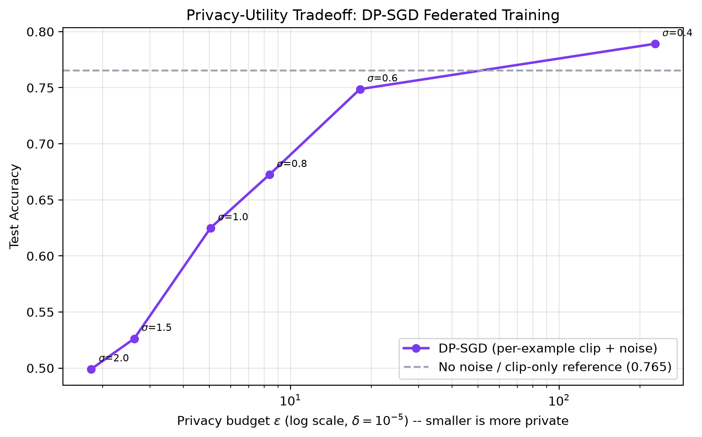

# Multi-Layer Privacy-Preserving Distributed Learning for Healthcare

## Project Overview

This repository implements a multi-layer, privacy-preserving distributed learning framework for binary heart-disease prediction, combining **Federated Learning**, **Split Learning**, **Differential Privacy (DP-SGD)**, **simulated Secure Aggregation**, and a **hash-chained audit ledger**. Raw patient data always remains at the hospital (client) side; only model updates -- and, where DP is enabled, only formally noised, individually-clipped updates -- ever leave a client.

Two complementary evaluation tracks are provided:

- **Paradigm comparison** (no DP): Centralized vs. Federated (FedProx) vs. SplitFed, on identical leakage-free data and evaluation protocol -- establishes the accuracy cost of keeping data local at all.
- **DP-SGD privacy ablation**: federated training with real per-example gradient clipping and calibrated Gaussian noise, swept across multiple noise levels and reported against a formally computed privacy budget (epsilon) -- establishes the accuracy cost of adding a *provable* privacy guarantee on top.

The codebase is organized for reproducibility, modularity, and benchmark-style experimentation.

## Problem Statement

Healthcare institutions often cannot pool patient records due to privacy, compliance, and ownership constraints. Standard centralized ML workflows are therefore difficult to deploy in real-world medical settings.

The challenge is to train accurate models while (a) keeping raw hospital data local, (b) bounding what an honest-but-curious server can infer from what it does receive, and (c) leaving a verifiable, tamper-evident record of the training process.

## Solution Summary

The project layers four independent privacy mechanisms, each addressing a different threat:

- **Federated Learning** -- local updates are computed on each hospital's own partition; only model parameters are aggregated centrally, never raw records.
- **Split Learning (SplitFed)** -- the network itself is cut into a client-side and server-side segment, so clients transmit intermediate activations rather than full model weights or raw features.
- **Differential Privacy (DP-SGD)** -- per-example gradient clipping bounds any single patient's influence on an update, and calibrated Gaussian noise gives a formal, mathematically provable (epsilon, delta) privacy guarantee, accounted for with a Renyi-DP moments accountant.
- **Secure Aggregation** -- a simulated pairwise-additive-masking protocol (the core mechanism behind Bonawitz et al.'s secure aggregation) ensures the server only ever observes the *sum* of client updates, never an individual client's update in the clear.
- **Audit Ledger** -- every training round is recorded in a hash-chained, tamper-evident log; altering any past round's recorded weights or metrics is detectable via chain verification.

A shared, leakage-free data pipeline enforces client-local scaling and strict held-out test evaluation across every mechanism above.

## Architecture (Text Description)

1. Raw tabular data is loaded, validated, encoded, and expanded into a reproducible training corpus.
2. The **original** patient records are split into disjoint train/test sets *before* any augmentation, so held-out patients (and their near-duplicates) never leak into training.
3. Non-IID hospital partitions are generated for five clients; each hospital's train/validation/test splits are scaled using train-only statistics.
4. Centralized pipeline trains a full model on the combined train split and evaluates on the strictly unseen global test split.
5. Federated pipeline runs FedProx rounds over hospital clients and evaluates the final global model on the same global test split.
6. SplitFed pipeline trains split client/server components per round, aggregates client-side weights, and evaluates on the same global test split.
7. **DP-SGD pipeline** repeats federated training with per-example clipped, Gaussian-noised local gradients, optionally routed through simulated secure aggregation and logged to the audit ledger; a Renyi-DP accountant converts the noise schedule into a formal epsilon.
8. Metrics and research artifacts are saved to `data/processed` and `plots`.

## Tech Stack

### Backend

- Python 3.10+
- TensorFlow / Keras
- Flower (FL simulation)
- NumPy, Pandas, scikit-learn, Matplotlib
- FastAPI (metrics API)

### Frontend Dashboard

- React (Vite)
- Tailwind CSS
- Recharts
- Framer Motion

## How to Run

### 1. Backend Setup

```bash
python3 -m venv venv
source venv/bin/activate
pip install -r requirements.txt
```

### 2. Run Training Pipelines (paradigm comparison, no DP)

```bash
python src/pipelines/train_eval_pipeline.py
python src/pipelines/federated_pipeline.py
python src/pipelines/splitfed_pipeline.py
```

### 3. Run the DP-SGD Privacy Ablation (optional)

```bash
python src/pipelines/dp_epsilon_sweep.py       # sweeps noise multipliers, reports epsilon vs. accuracy
python src/utils/generate_dp_plots.py          # regenerates plots/dp_epsilon_tradeoff.png
```

A single DP-SGD run with secure aggregation and audit logging enabled:

```python
from src.pipelines.dp_federated_pipeline import run_dp_federated_pipeline
run_dp_federated_pipeline(noise_multiplier=1.0, use_secure_aggregation=True, record_ledger=True)
```

### 4. Start Metrics API (Optional)

```bash
uvicorn src.utils.api_server:app --reload
```

### 5. Run Frontend Dashboard

```bash
cd frontend
npm install
npm run dev
```

## Results (Current Run)

| Method | Accuracy | Precision | Recall | F1 Score | ROC-AUC | Loss |
| --- | ---: | ---: | ---: | ---: | ---: | ---: |
| Centralized | 81.21% | 80.91% | 86.67% | 83.69% | 0.8831 | 0.4255 |
| Federated (FedProx) | 80.50% | 82.47% | 82.47% | 82.47% | 0.8711 | 0.6443 |
| SplitFed | 79.33% | 82.15% | 80.30% | 81.21% | 0.8696 | 0.5008 |

Metrics source: `data/processed/final_metrics.json`. Results are deterministic
(fixed seeds + TensorFlow op-determinism) and reproduce exactly on re-run.

The ordering follows the expected hierarchy: **Centralized ≥ Federated ≥ SplitFed**.
Centralized sees all data jointly and forms the upper bound; Federated pays a small cost
for keeping data local under non-IID partitions; SplitFed pays a further cost for
splitting the model across the client/server boundary. All three stay within a narrow,
realistic band on genuinely held-out patients.

## Differential Privacy Ablation

The paradigm-comparison numbers above use no differential privacy. To answer "what does
a *formal* privacy guarantee cost?", a separate DP-SGD ablation
(`src/pipelines/dp_epsilon_sweep.py`) trains the same federated setup with real
per-example gradient clipping and calibrated Gaussian noise (Abadi et al., 2016),
swept across noise multipliers, with epsilon computed via a Renyi-DP moments accountant
(`src/federated/dp_accountant.py`; delta = 1e-5). This is a shorter run (15 rounds / 2
local epochs, vs. 40 rounds for the headline federated result above) so its noise-free
reference point is not directly comparable to the Federated row in the table above --
it isolates the accuracy cost of clipping and noise, not the full federated budget.

| Noise multiplier (σ) | Epsilon (ε) | Test Accuracy |
| ---: | ---: | ---: |
| 0.0 (clip-only, no noise) | ∞ (no guarantee) | 76.54% |
| 0.4 | 227.6 | 78.92% |
| 0.6 | 18.2 | 74.88% |
| 0.8 | 8.4 | 67.25% |
| 1.0 | 5.0 | 62.50% |
| 1.5 | 2.6 | 52.63% |
| 2.0 | 1.8 | 49.92% |



Accuracy degrades monotonically as epsilon shrinks (stronger privacy), collapsing toward
chance-level (50%) under strong privacy (ε ≈ 1.8) -- expected behavior for a small
per-client dataset, where a fixed noise magnitude represents a much larger relative
perturbation than it would on a larger corpus. The epsilon accountant uses closed-form
integer-order RDP composition; validated against the canonical DP-SGD tutorial
configuration (Abadi et al. moments-accountant example), it reports epsilon ≈ 2.97
against a published ≈ 1.19 for the same parameters -- i.e. it is a valid but
conservative (safe-direction) bound, not a tightest-possible accountant.

Two additional privacy layers are implemented and can be composed with DP-SGD in the same
run:

- **Secure Aggregation** (`src/federated/secure_aggregation.py`) -- simulated
  pairwise-additive-masking so the server only ever sums masked client updates.
  Verified: aggregate reconstruction error ≈ 1e-7 against plaintext FedAvg (correctness),
  and the mask is independent of the plaintext by construction (non-leakage).
- **Audit Ledger** (`src/federated/audit_ledger.py`) -- a hash-chained, tamper-evident log
  of every training round. Verified: tampering with any past round's recorded weights or
  metrics is detected at the exact modified block via chain re-verification.

## Methodology & Refinements

The three training paradigms are unchanged. The pipeline was hardened for correctness and
fairness:

- **Leakage-free evaluation.** The original patient records are partitioned into disjoint
  train and test sets **before** any bootstrap augmentation, so a held-out patient's
  augmented near-duplicates can never appear in training. A collision check confirms 0%
  overlap between train and test rows. (Earlier runs augmented first and split second,
  which let near-duplicates straddle the boundary and inflated every score.)
- **LayerNormalization in place of BatchNormalization** across the full, client, and
  server models. Batch statistics are ill-defined when weights are averaged across
  non-IID hospitals; LayerNorm is per-sample and aggregation-safe.
- **Standard 0.5 decision threshold** applied identically to all three methods for a
  directly comparable operating point on the near-balanced classes.
- **Training schedule**: `ReduceLROnPlateau` with early stopping for the centralized
  model; FedProx over 40 rounds; SplitFed over 30 aggregation rounds.
- **Reproducibility**: fixed seeds and TensorFlow op-determinism across all pipelines.

## Key Insights

- Centralized learning is the upper bound (81.21%); the distributed methods trail it by a
  small, expected margin rather than exceeding it.
- Removing the train/test augmentation leakage brought SplitFed from an inflated ~88% down
  to a realistic 79.33%, restoring the correct method hierarchy.
- Federated training is competitive with centralized (80.50%) and well-calibrated under
  non-IID partitions after the normalization fix.
- Client-local scaling, a disjoint held-out test set, and a shared 0.5 threshold provide a
  fair, leakage-free comparison across all three paradigms.

## Figures

All figures are regenerated from the trained models and saved metrics and reflect the
scores in the table above.

| Test accuracy | Metric comparison |
| --- | --- |
|  |  |

| ROC curves | Precision-recall curves |
| --- | --- |
|  |  |

| Federated rounds | SplitFed rounds |
| --- | --- |
|  |  |

| Centralized training curves | SplitFed confusion matrix |
| --- | --- |
|  |  |

Regenerate every figure from the current models and metrics with:

```bash
python src/utils/generate_report_plots.py
```

## Project Structure

```text
src/
	data/
	federated/
	models/
	pipelines/
	utils/
data/
	raw/
	processed/
clients/
plots/
frontend/
docs/
models/
```

## Future Scope

- Add formal differential privacy accounting and privacy budgets.
- Add secure aggregation and encrypted transport validation.
- Extend evaluation with calibration, subgroup fairness, and uncertainty metrics.
- Package training as reproducible experiment configs (for sweep automation).

## Author

- Vedanth Dama
